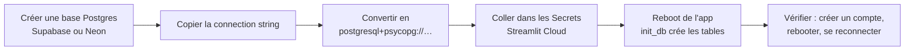

# Guide — brancher un Postgres persistant (bout en bout)

Ce guide connecte triagepath à une base **Postgres managée** pour que les
comptes et l'historique **survivent aux redéploiements** de Streamlit Cloud.

> Pourquoi : sur Streamlit Cloud le conteneur est éphémère et le dossier de
> travail est en lecture seule. Sans Postgres, l'app retombe sur un SQLite
> temporaire qui est **effacé à chaque redéploiement / redémarrage** → les
> comptes créés disparaissent. Le code accepte déjà un `DATABASE_URL` Postgres
> et le driver `psycopg[binary]` est fourni dans `requirements.txt`.

## Vue d'ensemble



---

## Étape 1 — Créer une base Postgres gratuite

Choisis **une** des deux (les deux ont un free tier suffisant pour une mono-équipe).

### Option A — Supabase
1. https://supabase.com → **New project**.
2. Note bien le **Database Password** que tu définis (il n'est plus affiché ensuite).
3. Une fois le projet prêt : **Project Settings → Database → Connection string**.
4. Prends l'onglet **Session pooler** (port `5432`) — c'est le plus simple et
   compatible avec les hôtes sans IPv6 comme Streamlit Cloud. La chaîne
   ressemble à ceci (les valeurs entre `<...>` viennent de ton dashboard) :
   ```text
   postgresql://<user>:<password>@<host>.pooler.supabase.com:5432/postgres
   ```

### Option B — Neon
1. https://neon.tech → **New project**.
2. **Dashboard → Connection Details → Connection string**. Elle ressemble à :
   ```text
   postgresql://<user>:<password>@<host>.aws.neon.tech/neondb?sslmode=require
   ```

---

## Étape 2 — Convertir la chaîne au format attendu

Le projet utilise **psycopg 3**, donc le schéma doit être `postgresql+psycopg://`
(et non `postgresql://` tout court). Remplace juste le début :

| Fourni par le dashboard | À utiliser dans `DATABASE_URL` |
|---|---|
| `postgresql://…` | `postgresql+psycopg://…` |

Assure-toi que le SSL est demandé. Si l'URL **n'a pas** encore de paramètre,
ajoute `?sslmode=require` à la fin ; si elle **contient déjà** un `?...`, ajoute
plutôt `&sslmode=require`. (Neon inclut déjà `sslmode=require`, Supabase l'accepte.)

**Forme finale** (garde les `<...>` comme repères, remplace-les par les valeurs
de ta propre chaîne — ne mets **jamais** de vraies identifiants dans un fichier
versionné) :
```text
# Supabase (session pooler)
postgresql+psycopg://<user>:<password>@<host>.pooler.supabase.com:5432/postgres?sslmode=require

# Neon
postgresql+psycopg://<user>:<password>@<host>.aws.neon.tech/neondb?sslmode=require
```

> Si ton mot de passe contient des caractères spéciaux (`@ : / ? #`), encode-les
> en pourcentage (ex. `@` → `%40`).

---

## Étape 3 — Tester la connexion **en local** avant de déployer

C'est le test de bout en bout le plus important : il valide la chaîne, le SSL et
les droits **avant** de toucher à la prod.

> ⚠️ Ce script **écrit** un utilisateur de test dans la base pointée par
> `DATABASE_URL`. Utilise une base de **dev / jetable** (ou un projet Supabase/Neon
> séparé), **pas** ta base de production. Sinon, supprime la ligne de test après
> coup (voir la requête de nettoyage plus bas).

```bash
# depuis la racine du repo, avec le venv installé (make install)
export DATABASE_URL="postgresql+psycopg://<user>:<password>@<host>/<db>?sslmode=require"

.venv/bin/python - <<'PY'
from db.repo import init_db, create_user, authenticate, resolve_database_url
print("URL active :", resolve_database_url().split("@")[-1])  # n'affiche pas le secret
init_db()                                   # crée les tables users / analyses
u = create_user("test@demo.com", "motdepasse")
print("compte créé, id =", u.id)
print("login OK :", authenticate("test@demo.com", "motdepasse") is not None)
print("mauvais mdp rejeté :", authenticate("test@demo.com", "x") is None)
PY
```

Résultat attendu :
```text
URL active : <host>/<db>
compte créé, id = 1
login OK : True
mauvais mdp rejeté : True
```

Si ça passe, la connexion end-to-end fonctionne. Nettoyage de la ligne de test
(dans le SQL editor de Supabase/Neon) :
```sql
delete from users where email = 'test@demo.com';
```

---

## Étape 4 — Configurer Streamlit Cloud

1. Ouvre ton app → **Manage app → Settings → Secrets**.
2. Ajoute la ligne `DATABASE_URL` (format TOML, entre guillemets) à côté de tes
   autres secrets :
   ```toml
   GROQ_API_KEY="ton_groq_key"
   GROQ_MODEL="llama-3.3-70b-versatile"
   JINA_API_KEY="ton_jina_key"
   APP_SECRET="une_longue_chaine_aleatoire"
   DEFAULT_LOCALE="fr"
   LLM_PROVIDER="mock"
   DATABASE_URL="postgresql+psycopg://<user>:<password>@<host>/<db>?sslmode=require"
   ```
3. **Save**. Streamlit redémarre l'app automatiquement.
4. Au premier boot, `init_db()` (appelé dans `ui/app.py`) crée les tables si
   elles n'existent pas. Rien d'autre à faire.

---

## Étape 5 — Vérifier la persistance de bout en bout

C'est le test qui prouve que le problème d'origine est réglé :

1. Sur l'app en ligne, **crée un compte** (email + mot de passe), connecte-toi.
2. Force un redémarrage : **Manage app → Reboot** (ou pousse un commit).
3. Une fois l'app relancée, **reconnecte-toi avec le même compte**.
   - ✅ La connexion réussit → les comptes persistent, Postgres est bien branché.
   - ❌ « identifiants invalides » → l'app tourne encore sur le SQLite éphémère
     (voir Dépannage).

Vérification côté base (optionnel) — dans le SQL editor de Supabase/Neon :
```sql
select id, email, created_at from users order by id;
select count(*) from analyses;
```

---

## Dépannage

| Symptôme | Cause probable | Correctif |
|---|---|---|
| Les comptes disparaissent encore après reboot | `DATABASE_URL` absent ou mal orthographié dans les Secrets | Re-vérifie la clé exacte `DATABASE_URL` et sauvegarde |
| `Can't load plugin: sqlalchemy.dialects:postgres` | Schéma `postgres://` au lieu de `postgresql+psycopg://` | Corrige le préfixe (voir Étape 2) |
| `ModuleNotFoundError: psycopg` | Vieux déploiement sans le driver | Assure-toi que la branche déployée contient `psycopg[binary]` dans `requirements.txt`, puis **Reboot** |
| `connection ... SSL required` | SSL manquant | Ajoute `sslmode=require` à l'URL (voir Étape 2) |
| `could not translate host name` / timeout de connexion | Chaîne « direct » IPv6-only de Supabase | Utilise la chaîne **Session pooler** (Étape 1A) |
| `password authentication failed` | Mot de passe faux ou caractères non encodés | Réinitialise le mot de passe DB et/ou encode les caractères spéciaux |

---

## Notes de sécurité

- Ne **commit jamais** le `DATABASE_URL` réel : il ne vit que dans les Secrets
  Streamlit Cloud et ton `.env` local (déjà gitignoré). Les exemples de ce guide
  sont volontairement redigés avec des placeholders `<...>`.
- En cas de fuite, **réinitialise le mot de passe** de la base depuis le
  dashboard et mets à jour le secret.
- Le checkpointer LangGraph (état d'analyse en cours) reste sur un fichier
  SQLite **local et éphémère** — c'est voulu : cet état est transitoire et sans
  intérêt à conserver entre redémarrages. Seules les tables `users` / `analyses`
  vont sur Postgres.
